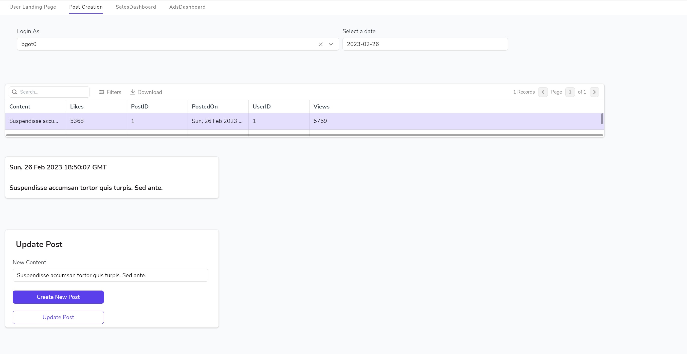

This app is built using Appsmith. Turn any datasource into an internal app in minutes. Appsmith lets you drag-and-drop components to build dashboards, write logic with JavaScript objects and connect to any API, database or GraphQL source.

# Project Overview
Livejournal is a social media platform designed to allow users to create on journal style post per day.

# Page Overview
## User landing page

Users can pretend to login as one of our existing users and select the date they want to view their posts on. They can also view, add or remove followers, and view what groups they are part of.

## Post Creation Page

Users can pretend to login as one of our existing users and select the date they want to view their posts then edit or create a post for the selected date.

## Sales Dashboard

Users can select a date and view a graph showing some sitewide statistics on a dashboard. Statistics are pulled from posts and user tracking metadata.

## Ad Dashboard

Users can create, update, and delete advertisements as well as view a company's sponsored users on the site.

### [Github](https://github.com/appsmithorg/appsmith) • [Docs](https://docs.appsmith.com/?utm_source=github&utm_medium=social&utm_content=appsmith_docs&utm_campaign=null&utm_term=appsmith_docs) • [Community](https://community.appsmith.com/) • [Tutorials](https://github.com/appsmithorg/appsmith/tree/update/readme#tutorials) • [Youtube](https://www.youtube.com/appsmith) • [Discord](https://discord.gg/rBTTVJp)

##### You can visit the application using the below link

######  
